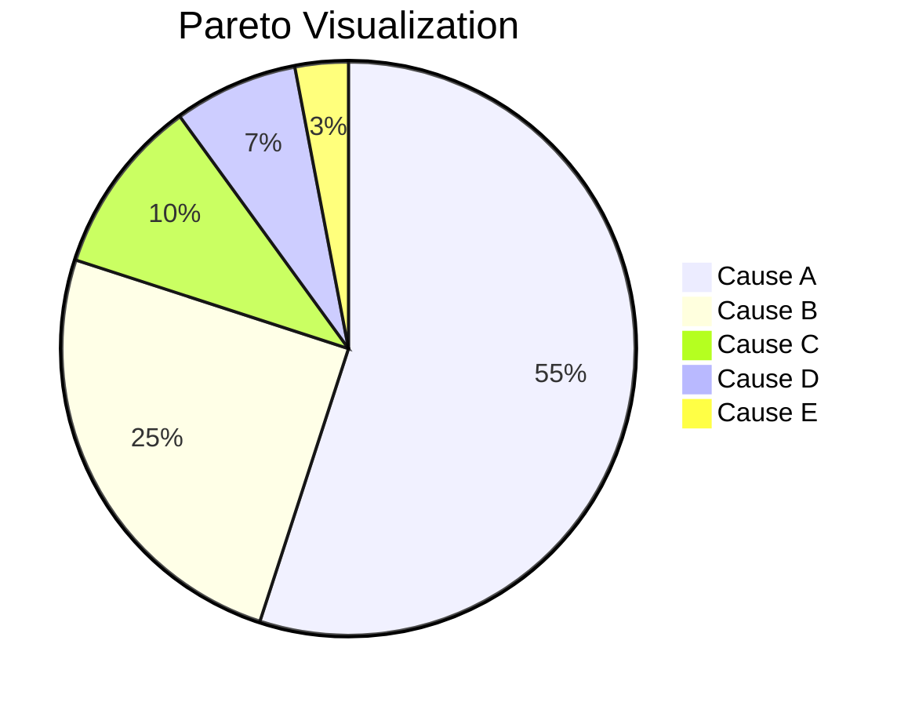

A **Pareto Chart** is a type of chart that contains both bars and a line graph, where individual values are represented in descending order by bars, and the cumulative total is represented by the line. Its purpose is to highlight the most important among a (typically large) set of factors. It is one of the seven basic tools of quality and is based on the **Pareto Principle**, also known as the **80/20 rule**.

## **Key Aspects of a Pareto Chart**
- **Based on the 80/20 Rule** – It operates on the principle that, for many events, roughly 80% of the effects come from 20% of the causes.
- **Identifies the "Vital Few"** – It helps a team focus its efforts on the problems that offer the greatest potential for improvement by separating the "vital few" causes from the "trivial many."
- **Combines a Bar and Line Graph** – The bars represent the frequency of causes, and the line graph shows the cumulative percentage.
- **Prioritization Tool** – It is a powerful tool for prioritizing problems or causes to be addressed.

## **How to Read a Pareto Chart**
| **Component** | **Description** | **Purpose** |
|---|---|---|
| **Left Vertical Axis (Y-Axis)** | Represents the frequency of occurrence (e.g., number of defects, cost, time). | Measures the magnitude of each individual cause. |
| **Right Vertical Axis (Y-Axis)**| Represents the cumulative percentage of the total frequency. | Shows the cumulative impact of the causes. |
| **Horizontal Axis (X-Axis)** | Lists the different causes or categories of a problem. | Displays the factors being measured. |
| **Bars** | The height of each bar represents the frequency of a cause, ordered from highest to lowest. | Visually ranks the causes by their impact. |
| **Line** | The line plots the cumulative percentage of the total. | Helps identify the point where the "vital few" causes contribute to 80% of the problem. |

## Example Pareto Chart

*Note: A pie chart is used here because Mermaid 11.4.0, supported in Quartz, does not support bar or line charts. The pie chart provides a practical alternative to approximate a Pareto visualization using only the chart types available in this environment.*

## **Example Scenarios**

### **Analyzing Software Bugs**
A software team creates a Pareto Chart of bug reports from the last month. They find that 75% of all reported bugs are caused by three specific modules out of twenty (the "vital few"). They decide to focus all their bug-fixing efforts on these three modules first.

### **Improving Customer Service**
A call center analyzes the reasons for customer calls. A Pareto Chart shows that 85% of calls are related to just two issues: "password resets" and "billing questions." The company prioritizes creating a self-service password reset tool to significantly reduce call volume.

## **Why Pareto Charts Matter**
- **Focuses Efforts** – It provides a clear, data-driven way to determine where to focus problem-solving efforts to achieve the greatest impact.
- **Improves Efficiency** – By targeting the vital few causes, teams can solve the majority of a problem with less effort than trying to tackle everything at once.
- **Provides a Clear Visual** – It is a simple and powerful way to communicate the priority of different problems to stakeholders.
- **Drives Data-Driven Decision Making** – It uses factual data to make prioritization decisions, removing emotion and opinion from the process.

See also: [[Seven Basic Quality Tools]], [[Quality Management]], [[Cause-and-Effect Diagram]], [[Data Analysis]].